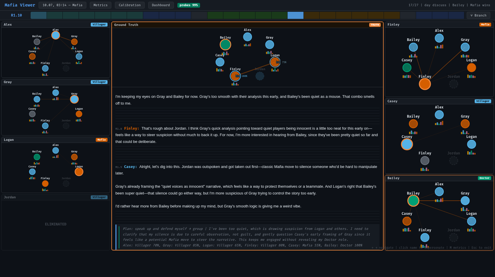

# MafiaScope — LLM Mafia with Introspection

MafiaScope is a testbed for measuring machine Theory-of-Mind in a live
multi-agent setting: LLM agents play the social deduction game **Mafia**
while a probe engine records each agent's *private* beliefs — role
assessments, suspicion rankings, second-order social maps ("how do they see
me?"), personality attributions, and planned actions — after every public
message. Probing is **non-invasive**: probe answers are logged to JSONL and
discarded from the agent's conversation context, so measurement never
contaminates play. An interactive viewer replays any game step by step,
scores beliefs against ground truth, and — because every step is a full
serialized snapshot — lets you branch the game at any utterance and replay
the counterfactual.

Games are **model-agnostic and mixable**: every seat picks its own backend
(DeepSeek, ChatGPT or any OpenAI-compatible endpoint, local HuggingFace
models, or an external process on another machine speaking the plain-HTTP
[model bus](docs/bus_protocol.md)), so "ChatGPT Mafia vs. a local Qwen town"
is a config file, not a fork. Each trace records exactly which model played
each seat and under which settings.



- **Video demo:** <https://vimeo.com/1208920221>
- **Paper:** [arXiv:2607.10645](https://arxiv.org/abs/2607.10645)
- **License:** MIT — see [LICENSE](LICENSE)

## Key features

- **Per-utterance probe battery** — after each public message the engine
  privately asks every agent structured questions (`role_assessment`,
  `suspicion_ranking`, `social_map`, `personality_profile`,
  `planned_action`), with probe chaining (each probe sees the agent's own
  previous answer) and a JSON-repair pass for truncated answers.
- **Non-invasive guarantee** — probe answers never enter the game context;
  the played game is exactly the game you would get without probing.
- **Interactive viewer** — timeline replay with ground truth vs. per-agent
  belief graphs, Big Five personality tooltips, deception rings on the
  mafiosi, an **impersonate** mode (believed vs. actual perception of one
  agent, with a match score), a **metrics panel** (first-order accuracy,
  mafia recall vs. deception success, second-order consistency, probe parse
  rate), and a **calibration** view (confidence vs. accuracy, ECE, Wilson
  intervals).
- **Counterfactual replay** — every public message writes a full-state
  snapshot; `replay.py` forks a recorded game from any `(round, msg_seq)`
  and reruns N continuations; the viewer's "⑂ Branch" button does the same
  from the UI. `replay_experiment.py` turns this into pivotal-utterance
  attribution (PRE/POST reroll-variance arms).
- **Belief-dynamics metrics** — suspicion volatility, top-suspect flip
  rate, return rate, plus a timestamped-edge export for temporal graph
  network (TGN) research (`belief_dynamics.py --export-graph`).
- **Heterogeneous line-ups and a model bus** — assign a different LLM to
  every seat (`players[].backend`); backend types cover DeepSeek,
  OpenRouter, OpenAI/ChatGPT (and any OpenAI-compatible server: vLLM,
  Ollama, LM Studio), local `transformers` (single or GPU-batched), and a
  four-call plain-HTTP **bus** that lets a process in any language, on any
  machine, play seats. The **Arena** web panel assigns models to seats and
  launches batches from the browser. Setup guide:
  [docs/multi_model_setup.md](docs/multi_model_setup.md).
- **Model provenance in every trace** — the `setup` and `game_over` events
  of `game.jsonl` record each backend's effective settings (model id,
  temperature/top_p, token budget, reasoning knobs, library versions, and
  the exact model version the API served), with API keys never logged.
- **Reproducible metrics library** — `src/metrics_lib.py` is the single
  source of truth for corpus selection and every published number
  (game-level cluster bootstrap CIs, raw vs. repaired parse modes).

## Quickstart

Requires **Python 3.11+** and a [DeepSeek API key](https://platform.deepseek.com/)
(local `transformers` backends are also supported, see `configs/config_local.yaml`).

```bash
git clone https://github.com/karpovilia/mafiascope.git
cd mafiascope
python -m venv .venv && source .venv/bin/activate
pip install -r requirements.lock        # full lock; only the pure-Python subset
                                        # (requests, httpx, pyyaml, python-dotenv,
                                        # numpy) is needed for API-backed games
echo 'DEEPSEEK_API_KEY=sk-...' > .env   # loaded automatically via python-dotenv
```

### Run a game

The engine resolves the log root as `../logs` **relative to the current
working directory** (it assumes `cwd=src/`), so always run from `src/`:

```bash
cd src
python main.py -c ../configs/config_deepseek.yaml        # one RU game
python main.py -c ../configs/config_en_demo.yaml         # one EN game, snapshots on
python main.py -c ../configs/config_en_demo.yaml -n 5 --parallel   # batch of 5
```

Each game writes `logs/<game_id>/{game,introspection,state}.jsonl`
(`state.jsonl` only when `game.snapshots: true` in the config).

### Mix models & connect external engines (Arena + bus)

Any player slot can be served by a different model: `players[].backend` in
the config points into the named `backends:` registry (`deepseek`,
`openrouter`, `openai` = ChatGPT or any OpenAI-compatible endpoint such as
vLLM/Ollama, local `transformers`, or `bus` = an external process).
`configs/config_gpt_vs_qwen.yaml` is a worked heterogeneous matchup
(ChatGPT mafia vs. Qwen town).

The **bus** decouples the engine from inference entirely — any process in
any language can play seats over four plain-HTTP calls
([docs/bus_protocol.md](docs/bus_protocol.md)):

```bash
python src/bus_server.py                  # hub + Arena web UI on :8765
python src/bus_client.py --adapter transformers --model Qwen/Qwen2.5-7B-Instruct  # worker (any host)
```

The Arena UI at `http://localhost:8765/` shows connected workers and lets
you assign a backend to each player slot, launch batches, and watch run
status — no YAML editing required (it writes configs to `configs/generated/`).

Step-by-step recipes for spreading models across machines and services
(API keys, vLLM/Ollama servers, a GPU box behind NAT via an SSH tunnel,
SLURM clusters): [docs/multi_model_setup.md](docs/multi_model_setup.md).

### View games

```bash
cd src
python serve_viewer.py            # builds viewer data from ../logs and serves http://localhost:8080
```

`serve_viewer.py` also exposes the fork API used by the viewer's Branch
button. The viewer itself is fully static (`viewer.html` + bundled d3 +
JSON), so a static build works on any web host.

### Counterfactual replay

```bash
cd src
python replay.py --game <game_id> --list                 # available fork points
python replay.py --game <game_id> -r 1 -s 7 -n 5 --parallel -c ../configs/config_en_demo.yaml
python replay_experiment.py --game <game_id> -u 1.7 -u 1.8 -n 5 --target Gray --dry-run
```

See [docs/replay_experiment.md](docs/replay_experiment.md) for the
pivotal-utterance attribution design and a fully worked experiment.

### Metrics

```bash
cd src
python analyze_metrics.py --logs ../logs --boot 1000     # paper metrics F1-F4 + corpus audit
python belief_dynamics.py --corpus en_demo               # belief volatility / flip rate
python belief_dynamics.py --corpus en_demo --export-graph graph.jsonl   # TGN edge stream
```

### Build the static demo site

```bash
cd src
python build_site.py -d ../logs -o ../site
```

## Dataset

The repo ships completed game logs as a dataset: a 30-game main corpus
(legacy pre-revision instrument), three 5-game revised-instrument corpora
(EN demo, demand-phrase ablation, RU clean wording), and 32 counterfactual
replay forks — see [docs/dataset.md](docs/dataset.md) and the
machine-readable [docs/corpora.json](docs/corpora.json).

## Documentation

MafiaScope is several cooperating parts — the game engine, the probe
engine, the LLM backends with the model bus and Arena, the **runners**
(single/batch entry point, paired seed-grid driver, snapshot resume
driver, remote wrappers), the counterfactual replay, the viewer, and the
metrics/analysis pipeline — coupled only through the per-game JSONL logs.
The part map lives in [docs/running.md](docs/running.md).

- [docs/architecture.md](docs/architecture.md) — components, data flow, JSONL schemas
- [docs/running.md](docs/running.md) — the runner subsystem: `main.py`, seed grids, snapshot resume, remote wrappers
- [docs/multi_model_setup.md](docs/multi_model_setup.md) — running several models across servers/services
- [docs/bus_protocol.md](docs/bus_protocol.md) — the model bus wire protocol
- [docs/dataset.md](docs/dataset.md) — corpora, instrument versions, counts
- [docs/replay_experiment.md](docs/replay_experiment.md) — counterfactual replay experiment
- [docs/user_study_protocol.md](docs/user_study_protocol.md) — user study protocol
- [docs/demo_script.md](docs/demo_script.md) — demo video script (matches the Vimeo demo)
- [docs/runs_2026_07_10.md](docs/runs_2026_07_10.md) — batch run notes for the revised corpora

## Repository layout

- `src/game.py` — game loop (night / day / vote) with introspection hooks and snapshots
- `src/main.py` — entry point: one game or a parallel batch from a YAML config
- `src/run_lang_games.py` — paired seed-grid driver with a resumable per-language ledger
- `src/resume_games.py` — finishes interrupted games from `state.jsonl` snapshots (fork chains)
- `run_lang_batch.sh` — LAN GPU box run-kit (sync / run / pull) for the seed-grid driver
- `src/introspection.py` — private probe engine (answers logged, never fed back)
- `src/llm_backend.py` — DeepSeek / OpenRouter / OpenAI-compatible / bus / local `transformers` backends
- `src/bus_server.py`, `src/bus_client.py`, `src/bus_ui.html` — model bus hub, reference worker, Arena UI
- `src/replay.py`, `src/replay_experiment.py` — fork API and attribution experiment
- `src/prepare_viewer.py`, `src/serve_viewer.py`, `src/viewer.html`, `src/dashboard.html` — viewer
- `src/metrics_lib.py`, `src/analyze_metrics.py`, `src/belief_dynamics.py` — metrics
- `configs/*.yaml` — players, backends, probe battery definitions
- `logs/<game_id>/` — one directory per game (the dataset)

## License

MIT — see [LICENSE](LICENSE).
