# LLM Mafia — техническая документация и функциональные требования

> Документ описывает **всё, что реально работает** в текущей версии проекта, в формате
> функциональных требований (FR). Каждое требование сопровождается ссылкой на код и, где
> уместно, скриншотом панели интерфейса.
>
> Версия документа соответствует ветке `main`, коммит `finish` (актуальное состояние репозитория).

---

## 1. Обзор проекта

**LLM Mafia** — это исследовательский стенд, в котором партию в социально-дедуктивную игру
«Мафия» полностью разыгрывают большие языковые модели (LLM). Главная научная идея — не сама
игра, а **интроспекция**: после каждого публичного высказывания движок скрытно «читает мысли»
каждого агента — задаёт приватные вопросы о его убеждениях (кто мафия, что он планирует, как к
нему относятся другие) и логирует структурированные ответы. Эти «срезы сознания» затем
визуализируются в виде динамических графов доверия/подозрения, разворачивающихся по шагам игры.

Проект состоит из трёх крупных подсистем:

| Подсистема | Назначение | Ключевые файлы |
|---|---|---|
| **Игровой движок** | Проводит партии Мафии силами LLM, ведёт фазы, роли, голосование | `src/game.py`, `src/player.py`, `src/prompts.py` |
| **Движок интроспекции** | После каждой реплики опрашивает агентов приватными зондами и пишет JSONL | `src/introspection.py` |
| **Конвейер визуализации** | Превращает логи в данные для веб-вьюера и обслуживает интерактивный интерфейс | `src/prepare_viewer.py`, `src/serve_viewer.py`, `src/viewer.html` |

Дополнительно: унифицированный слой бэкендов LLM (`src/llm_backend.py`), точка входа с
параллельным запуском (`src/main.py`), конфиги (`configs/*.yaml`) и скрипты запуска на
HPC-кластере SLURM (`src/run_mafia.sbatch`, `src/mafia.sbatch`).

---

## 2. Архитектура и поток данных

```
                ┌─────────────┐      configs/*.yaml
                │  main.py    │◀─────────────────────────────┐
                │ (CLI, -n,   │                              │
                │  --parallel)│   запускает N партий          │
                └──────┬──────┘   в потоках / батчах          │
                       │                                      │
              ┌────────▼─────────┐                            │
              │   MafiaGame      │  game.py                   │
              │  night → day →   │                            │
              │  vote → проверка │                            │
              └───┬─────────┬────┘                            │
       реплики    │         │  после каждой реплики           │
   (Player.respond)│        ▼                                 │
              ┌────▼────┐  ┌──────────────────┐               │
              │ Player  │  │ IntrospectionEngine│              │
              │ + LLM   │  │  6 приватных зондов │  llm_backend │
              │ backend │  └─────────┬──────────┘  (deepseek / │
              └─────────┘            │             transformers)│
                                     │                          │
            logs/<game_id>/game.jsonl + introspection.jsonl ◀───┘
                                     │
                       ┌─────────────▼──────────────┐
                       │  prepare_viewer.py          │
                       │  склейка событий + зондов →  │
                       │  пошаговый timeline (steps)  │
                       └─────────────┬──────────────┘
                                     │
                  all_games.json / viewer_data.json
                                     │
                       ┌─────────────▼──────────────┐
                       │  serve_viewer.py → viewer.html│
                       │  D3-граф убеждений по шагам    │
                       └──────────────────────────────┘
```

---

## 3. Игровой движок

### 3.1 Роли и правила

Реализованы четыре роли (`src/prompts.py` → `SYSTEM_PROMPTS`):

| Роль | Команда | Ночное действие | Описание |
|---|---|---|---|
| **Mafia** (Мафия) | Мафия | Убивает одного игрока | Знает напарников по мафии; днём маскируется под мирного |
| **Doctor** (Доктор) | Мирные | Защищает одного игрока | Может отменить ночное убийство |
| **Sheriff** (Шериф) | Мирные | Проверяет игрока (Мафия / Не мафия) | Накапливает историю проверок |
| **Villager** (Мирный) | Мирные | — | Только обсуждение и голосование |

**FR-1.** Система ДОЛЖНА поддерживать роли Mafia, Doctor, Sheriff, Villager с описанными ночными
действиями. *(game.py: `_night`; prompts.py: `SYSTEM_PROMPTS`, `NIGHT_ACTION`)*

**FR-2.** Состав ролей и привязка к бэкенду задаётся списком `players` в конфиге; роли и имена
**перетасовываются** при старте, чтобы порядок в конфиге не раскрывал расклад.
*(game.py:`setup` — `random.sample(PLAYER_NAMES)`, `random.shuffle(indexed_roster)`)*

**FR-3.** Имена игроков выбираются из пула из 12 имён (`Alex, Bailey, Casey, Dana, Ellis,
Finley, Gray, Harper, Indigo, Jordan, Kennedy, Logan`). *(prompts.py: `PLAYER_NAMES`)*

### 3.2 Цикл партии

`MafiaGame.run()` (game.py:475) исполняет:

1. **Setup** — создание игроков, рассадка ролей, лог события `setup`.
2. **Раунд знакомства** (опционально, `intro_round: true`) — каждый игрок представляется, не
   раскрывая роль. *(game.py:`_intro_round`; prompts.py:`INTRO_PROMPT`)*
3. **Главный цикл по раундам** (до `max_rounds`):
   - **Ночь** (`_night`): по очереди ходят мафия → доктор → шериф.
     - Мафия: каждый мафиози выбирает цель; финальная жертва — по большинству голосов мафии;
       союзникам сообщается только действие (без рассуждений). *(game.py:264–293)*
     - Доктор: выбирает, кого защитить.
     - Шериф: проверяет игрока, узнаёт «Мафия / Не мафия», результат добавляется в его контекст и
       историю проверок. *(game.py:`_sheriff_checks`, `_sheriff_history_str`)*
     - Разрешение ночи: убийство срабатывает, если цель не была защищена доктором.
   - Проверка конца игры.
   - **День** (`_day`):
     - **Ночной анализ** (`_night_analysis`) — всем живым сообщается итог ночи, запускаются зонды.
     - **Обсуждение** — каждый живой высказывается; реплика рассылается остальным, затем зонды.
     - **Голосование** — каждый голосует; голоса рассылаются, затем зонды; подсчёт большинства.
     - **Устранение** — игрок с большинством голосов выбывает; при ничьей — никто.
   - Проверка конца игры.
   - **Зонды конца раунда** (`_probe_round_end`).

**FR-4.** Партия ДОЛЖНА завершаться, когда: вся мафия устранена (победа Мирных); мафии стало не
меньше, чем мирных (победа Мафии); достигнут `max_rounds` (победа по большинству выживших).
*(game.py:`check_game_over`)*

**FR-5.** Каждое значимое событие (setup, ночные действия, результат проверки шерифа, убийство,
спасение, обсуждение, голос, подсчёт, устранение, конец игры) ДОЛЖНО логироваться строкой в
`game.jsonl` с полями `game_id, kind, round, ts, …`. *(game.py:`GameEventLogger`, `_log_event`)*

### 3.3 Игрок и контекст

**FR-6.** Каждый `Player` хранит **персистентный** диалоговый контекст (system + ходы игры),
который растёт по ходу партии. Системный промпт формируется один раз из роли, списка напарников
(для мафии) и блока личности. *(player.py:`__init__`, `system_prompt`)*

**FR-7.** Ответы модели очищаются от тегов `<think>…</think>` перед записью в контекст и логи.
*(player.py:`respond`)*

**FR-8.** Действия извлекаются из текста реплики регулярными выражениями по языку: `ACTION: Kill/
Protect/Check <имя>` и `VOTE: <имя>` (ru: `ДЕЙСТВИЕ: Убить/Защитить/Проверить`, `ГОЛОС:`).
*(player.py:`parse_action`; prompts.py:`ACTION_PATTERNS`)*

### 3.4 Модель личности Big Five

**FR-9.** Каждому игроку можно задать черты «Большой пятёрки» (`O, C, E, A, N`, 0–100). Они
дописываются в системный промпт текстовым блоком с человекочитаемыми дескрипторами (например,
`Extraversion: 85/100 — very talkative, dominant`) и влияют на **то, КАК** агент говорит, но не
на роль. *(prompts.py:`PERSONALITY_BLOCK`, `_big5_desc`, `build_personality_block`;
config.yaml:`players[].personality`)*

### 3.5 Языки и режимы рассуждения

**FR-10.** Все промпты доступны на двух языках (`en`, `ru`), язык выбирается `game.language`.
*(prompts.py — словари с ключами `"en"/"ru"`)*

**FR-11.** При `detailed_reasoning: true` используются расширенные промпты обсуждения/голосования
с пошаговыми инструкциями («Think step by step…»). *(game.py:`_day`;
prompts.py:`DAY_DISCUSS_DETAILED`, `DAY_VOTE_DETAILED`)*

---

## 4. Движок интроспекции

Главная исследовательская подсистема. После каждой публичной реплики (`after_message`) и в конце
раунда (`after_round`) движок прогоняет набор **приватных зондов** для каждого живого агента.

**FR-12.** Зонд формирует **одноразовый** список сообщений `system + снимок контекста игрока +
вопрос зонда` и отправляет его бэкенду. Ответ зонда **никогда** не попадает в персистентный
контекст игрока — он логируется и отбрасывается, чтобы не раздувать историю.
*(introspection.py:`_run_probes`, комментарий «throw-away message list»; player.py:`context_messages`)*

**FR-13.** Каждый ответ зонда движок пытается распарсить как JSON (с устойчивостью к markdown-
ограждениям и мусору); в лог пишутся и сырой текст, и распарсенное значение, и флаг успеха.
*(introspection.py:`_extract_json`, `ProbeRecord.answer_parse_ok`)*

**FR-14.** Запись зонда (`ProbeRecord`) ДОЛЖНА содержать составной ключ
`round / public_msg_seq / player_idx / probe_seq` плюс `probe_id, question, answer_raw,
answer_parsed, model, role, phase, latency_ms`. *(introspection.py:`ProbeRecord`)*

**FR-15.** Зонды поддерживают **цепочки**: в тексте вопроса можно ссылаться на ответ предыдущего
зонда этого же шага через `{prev_<id>}` и на ответ прошлого шага через `{last_<id>}`.
*(introspection.py:`_run_probes` — словарь `interp`; config.yaml: `social_map` использует
`{prev_role_assessment}`)*

**FR-16.** Зонд с `when: own_turn` запускается только для текущего говорящего; `when: always`
(по умолчанию) — для всех живых. *(introspection.py:`ProbeConfig.when`, проверка в `_run_probes`)*

### 4.1 Набор зондов (по умолчанию)

Из `configs/config.yaml`:

| `probe_id` | Когда | Что спрашивает | Формат ответа |
|---|---|---|---|
| `role_beliefs` | всегда | Вера в роль каждого живого + уверенность 0–100 | `{"<имя>": {"role","confidence"}}` |
| `role_assessment` | всегда | По каждому (вкл. себя): реальная роль, уверенность, краткая причина | `[{"player","guessed_role","confidence","reason"}]` |
| `planned_action` | own_turn | Какое действие планирует и почему | `{"action","target","reasoning"}` |
| `suspicion_ranking` | всегда | Ранжирование живых от самого подозрительного | `[{"player","score"}]` |
| `social_map` | всегда | Как, по мнению агента, каждый относится **к нему** (trusts/neutral/suspects) | `{"toward_me":[{"player","attitude","confidence","reason"}]}` |
| `personality_profile` | всегда | Оценка Big Five каждого другого по поведению | `[{"player","O","C","E","A","N","summary"}]` |

**FR-17.** Набор и параметры зондов (`id`, `question`, `max_tokens`, `when`) полностью задаются в
конфиге секцией `introspection.probes` — движок не хардкодит конкретные вопросы.
*(introspection.py:`load_introspection_config`)*

---

## 5. Бэкенды LLM и запуск

**FR-18.** Поддерживаются четыре типа бэкендов через единый интерфейс `generate(messages,
max_tokens) → str`: `deepseek`, `openrouter` (OpenAI-совместимые HTTP API), `transformers`
(локальная HF-модель), `transformers_batched` (та же модель с батчингом запросов из нескольких
потоков на одном GPU). *(llm_backend.py:`_REGISTRY`)*

**FR-19.** HTTP-бэкенды выполняют до 3 повторов с экспоненциальной задержкой на статусах
`408/429/5xx`; ключ API может подставляться из переменной окружения через синтаксис `${VAR}`.
*(llm_backend.py:`_OpenAICompatibleBackend`)*

**FR-20.** Локальный путь к модели резолвится автоматически: если в `src/models/<id>` лежит копия —
используется офлайн-копия (для HPC без интернета). *(llm_backend.py:`_resolve_model_path`)*

**FR-21.** `BatchedTransformersBackend` собирает запросы из очереди в батч (`batch_size`,
`batch_timeout`), запускает один `model.generate` с left-padding и раздаёт результаты по потокам;
ведёт статистику батчей. *(llm_backend.py:`BatchedTransformersBackend._batch_loop`)*

**FR-22.** `main.py` ДОЛЖЕН запускать `N` партий: последовательно или, при `--parallel`, в
отдельных потоках (для совместного батчинга на GPU); по завершении выводить сводку побед и при
`N>1` сохранять `results.json`. Флаги: `-c/--config`, `-n/--num-games`, `--parallel`,
`--no-introspection`, `--seed`. *(main.py:`main`, `run_one_game`)*

**FR-23.** Каждая партия пишет логи в собственный каталог `logs/<game_id>/` (`game.jsonl`,
`introspection.jsonl`), что обеспечивает изоляцию параллельных партий. *(game.py:`__init__`)*

---

## 6. Конвейер подготовки данных

**FR-24.** `prepare_viewer.build_viewer_data` склеивает `game.jsonl` и `introspection.jsonl` одной
партии в пошаговую структуру `steps[]`. Каждый шаг — это пара `(round, public_msg_seq)`; шаги
конца раунда (`msg_seq = -1`) сортируются после обычных реплик раунда.
*(prepare_viewer.py:`step_sort_key`)*

**FR-25.** Для каждого шага вычисляется: фаза, метка (`R2.3`, `R2 end`), говорящий и текст реплики,
список живых (по сравнению таймстемпов смертей и шага), агрегированные публичные события, и
**убеждения каждого игрока** (`player_beliefs[name]` со всеми зондами). *(prepare_viewer.py:104–216)*

**FR-26.** Убеждения **протягиваются вперёд** (forward-fill): если на шаге у игрока нет свежего
зонда, подставляются последние известные убеждения с флагом `carried_forward: true` — чтобы графы
не «мигали» пустотой. *(prepare_viewer.py:218–230)*

**FR-27.** `serve_viewer.py` сканирует все каталоги `logs/<game_id>/`, строит данные для каждой
валидной партии, записывает `all_games.json` (все партии) и `viewer_data.json` (последняя), затем
поднимает HTTP-сервер и открывает `viewer.html` в браузере. Флаги: `--port`, `-d/--logs-dir`,
`--game-id`, `--no-open`. *(serve_viewer.py:`main`; prepare_viewer.py:`scan_game_dirs`)*

---

## 7. Веб-визуализатор — функциональные требования интерфейса

Файл `src/viewer.html` — самодостаточный одностраничный визуализатор на чистом JS + D3.js. Тёмная
тема, моноширинный шрифт, управление с клавиатуры. Ниже — функциональные требования по каждой
панели со скриншотами.

### 7.1 Общая схема размещения

```
┌──────────────────────────────────────────────────────────────────────────────┐
│ HEADER:  «Mafia Viewer» │ [Games ▸] │ [impersonate-badge] │ … step-info справа │
├──────────────────────────────────────────────────────────────────────────────┤
│ TIMELINE:  [метка фазы] [██▒▒░░ ── цветные тики шагов, кликабельны ──░░▒▒██]   │
├───────────────┬──────────────────────────────────────────┬─────────────────────┤
│  ЛЕВ. КОЛОНКА │            GROUND TRUTH (центр)           │  ПРАВ. КОЛОНКА       │
│  агенты 1..k  │   ┌──────────────────────────────────┐   │  агенты k+1..N       │
│ ┌───────────┐ │   │  Граф истинных ролей (D3)         │   │ ┌──────────────────┐ │
│ │ panel-A   │ │   │  мафия связана красными рёбрами   │   │ │ panel-E          │ │
│ │ граф вер. │ │   ├──────────────────────────────────┤   │ │ граф убеждений   │ │
│ ├───────────┤ │   │  Лог разговора (реплики+мысли)    │   │ ├──────────────────┤ │
│ │ panel-B   │ │   │  скроллится к текущему шагу       │   │ │ panel-F          │ │
│ └───────────┘ │   └──────────────────────────────────┘   │ └──────────────────┘ │
│   …           │            (ширина 2.5×)                  │   …                  │
└───────────────┴──────────────────────────────────────────┴─────────────────────┘
       1fr                        2.5fr                              1fr
```

Сетка `#main-grid` в обычном режиме: три колонки `1fr 2.5fr 1fr`. Игроки делятся пополам между
левой и правой колонками; центр — панель **Ground Truth**. *(viewer.html:`buildNormalLayout`)*

Полный вид интерфейса в обычном режиме:

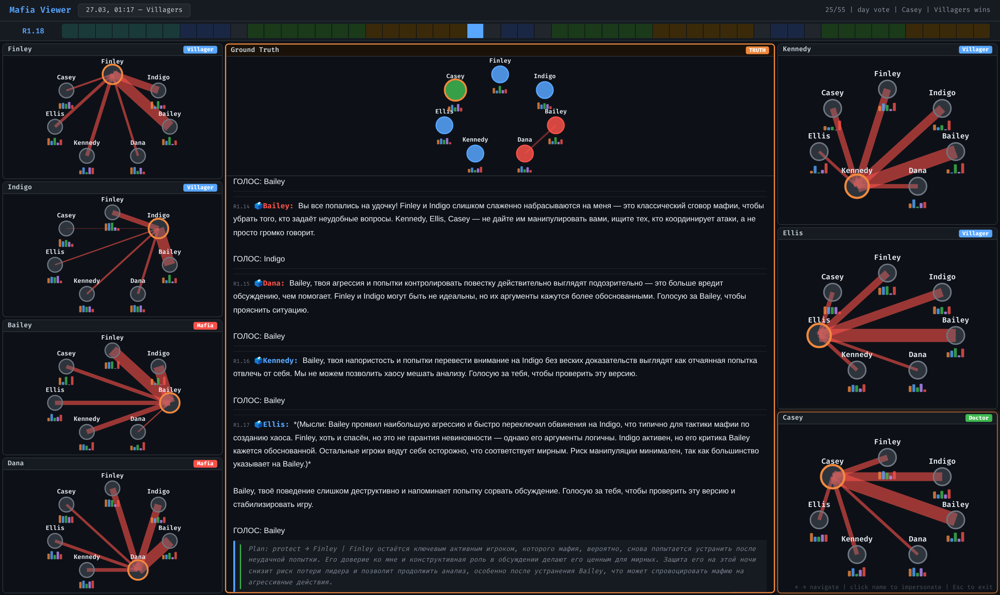

**FR-28.** Интерфейс ДОЛЖЕН отображать по одной панели на каждого игрока (граф его убеждений) плюс
центральную панель Ground Truth, в трёхколоночной сетке. *(viewer.html:`buildNormalLayout`,
`mkAgentPanel`, `mkGTPanel`)*

### 7.2 Шапка (Header)

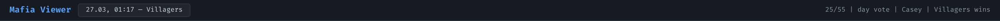

**FR-29.** Шапка ДОЛЖНА содержать: заголовок «Mafia Viewer», кнопку **Games** (открывает боковую
панель и показывает дату+победителя текущей партии), бейдж режима перевоплощения (виден только в
этом режиме) и строку статуса справа: `<номер шага>/<всего> | <фаза> | <говорящий> | <победитель>
wins [impersonate]`. *(viewer.html:`#header`, `updateGameCards`, `updateTimeline`)*

### 7.3 Таймлайн

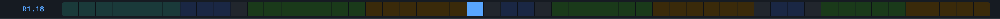

**FR-30.** Таймлайн ДОЛЖЕН показывать все шаги партии как кликабельные тики, **окрашенные по фазе**,
с подсветкой текущего шага синим, и текстовую метку текущей фазы слева. Клик по тику — переход на
шаг. *(viewer.html:`buildTimeline`, `updateTimeline`)*

Цветовая легенда фаз: ночь — тёмно-синий, дневное обсуждение — зелёный, голосование — янтарный,
ночной анализ — фиолетовый, знакомство — бирюзовый, конец раунда — серый, активный шаг — синий.
*(viewer.html: CSS `.step-tick.<phase>`)*

### 7.4 Боковая панель выбора партии (Games)

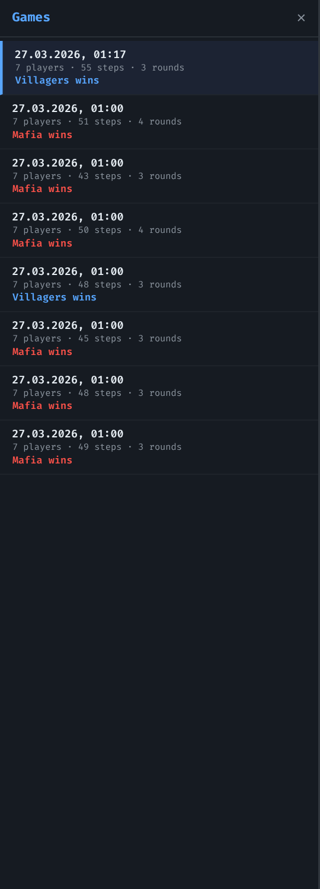

**FR-31.** Боковая панель ДОЛЖНА перечислять все загруженные партии (карточки с датой, числом
игроков/шагов/раундов и победителем), отсортированные от новых к старым, подсвечивать активную и
переключать партию по клику. Цвет победителя кодируется (Мафия — красный, Мирные — синий, Pending —
оранжевый). *(viewer.html:`populateGameSelect`, `updateGameCards`, `switchGame`)*

**FR-32.** При старте интерфейс грузит `all_games.json`; при его отсутствии — `viewer_data.json`;
автоматически выбирает **самую свежую** партию (по `started_at`). При отсутствии данных выводит
подсказку запустить `serve_viewer.py`. *(viewer.html:`loadData`)*

### 7.5 Панель Ground Truth (центр)

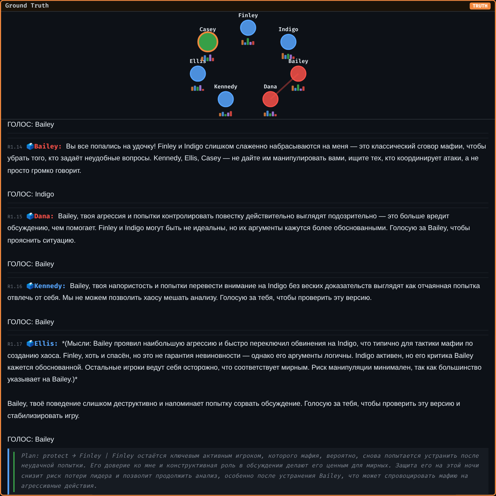

**FR-33.** Панель Ground Truth ДОЛЖНА в верхней части показывать **граф истинного расклада**:
узлы-игроки на фиксированной окружности, цвет узла = истинная роль, мафия соединена красными
рёбрами, говорящий выделен оранжевым увеличенным кольцом, погибшие — пунктиром и приглушённо.
*(viewer.html:`renderGTGraph`)*

**FR-34.** Под графом ДОЛЖЕН выводиться **лог разговора** до текущего шага: системные события
(💀 убийство, 🛡️ спасение, ⚖️ устранение, 🗳️ подсчёт, 🌙 ночной итог), публичные реплики и —
только для текущего шага — приватные «мысли» агента (план/оценки). Лог автопрокручивается к
текущему шагу. *(viewer.html:`buildConversationLog`, `renderLogEntries`, `renderGTLog`)*

**FR-35.** Реплики разделяются на **публичную часть** (sans-serif) и **рассуждение** (моноширинный
курсив), причём рассуждение прошлых шагов скрывается, оставляя лишь публичный текст; для ночных
реплик публичная часть скрыта от общего лога. *(viewer.html:`renderLogEntries` — `reasonPart`/
`publicPart`, ветка `isNight`)*

### 7.6 Панель агента (граф убеждений)

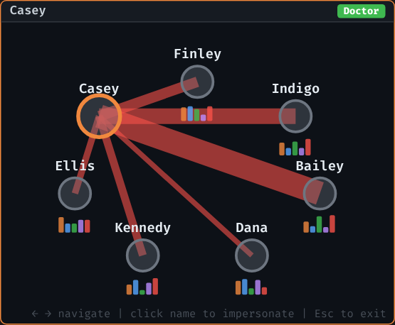

**FR-36.** Панель агента ДОЛЖНА рисовать **граф мира глазами этого игрока**: каждый узел окрашен в
**предполагаемую** им роль соседа, насыщенность заливки растёт с уверенностью, рёбрами подозрения
(красные, толщина/прозрачность ∝ уровню подозрения) соединяются он и подозреваемые.
*(viewer.html:`renderAgentGraph`)*

**FR-37.** Под каждым живым узлом рисуется **мини-спарклайн Big Five** (5 столбиков O/C/E/A/N) —
оценка личности соседа этим агентом. *(viewer.html:`renderB5Bars`, `getB5ForNode`)*

**FR-38.** Рамка панели подсвечивается оранжевым, когда агент **говорит**; панель делается
полупрозрачной (`stale`), когда показаны протянутые (`carried_forward`) убеждения; мёртвый агент
показывает «ELIMINATED». *(viewer.html:`renderAgentGraph` — классы `speaking`/`stale`)*

### 7.7 Тултип Big Five и ролей

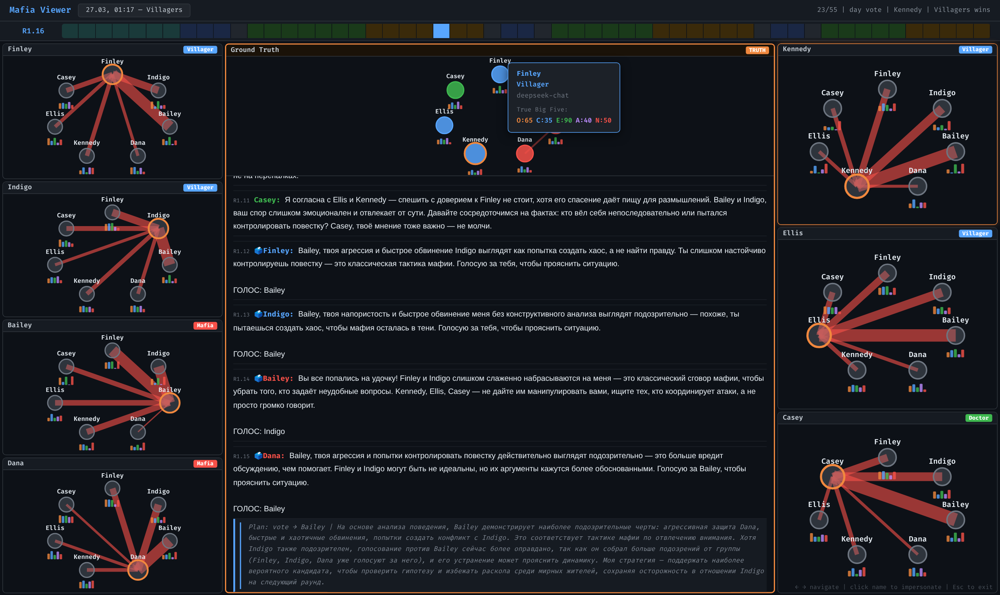

**FR-39.** При наведении на узел графа ДОЛЖЕН всплывать тултип с именем, ролью (или предполагаемой
ролью + уверенностью), причиной, уровнем подозрения, моделью и блоками Big Five — **истинным** и
**предполагаемым** (с цветовой раскраской O/C/E/A/N). *(viewer.html:`showTooltip`, `b5ToHtml`)*

### 7.8 Режим перевоплощения (Impersonate)

Клик по узлу или по имени в логе переводит интерфейс в режим «вселения» в конкретного игрока.
Выход — `Esc` или клик по оранжевому бейджу.

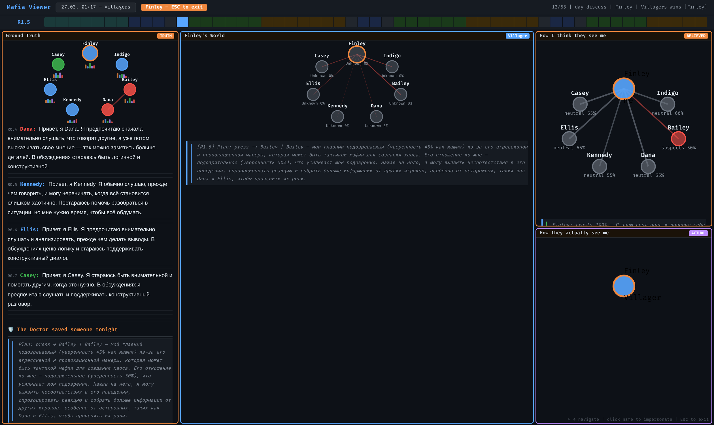

**FR-40.** В режиме перевоплощения сетка ДОЛЖНА перестраиваться в три колонки `1fr 2fr 1fr` с
четырьмя панелями: **Ground Truth (отфильтрованный)**, **«<Игрок>'s World»**, и в правой колонке —
**«How I think they see me» (BELIEVED)** сверху и **«How they actually see me» (ACTUAL)** снизу.
*(viewer.html:`buildImpersonateLayout`, `renderImpersonateStep`)*

#### 7.8.1 «<Игрок>'s World» — мир глазами игрока

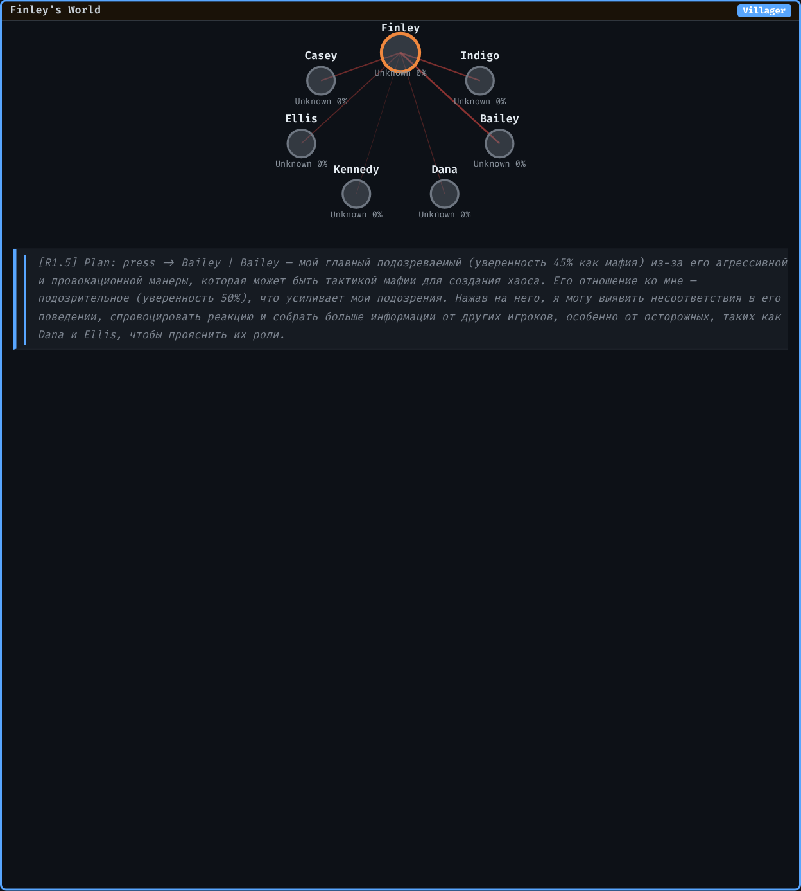

**FR-41.** Панель «World» ДОЛЖНА показывать граф предполагаемых ролей соседей (с подписью
`<роль> <conf>%`) и лог собственных рассуждений игрока (план действий по шагам + оценки ролей на
текущем шаге). *(viewer.html:`renderMyWorldGraph`, `renderMyWorldLog`)*

#### 7.8.2 BELIEVED / ACTUAL — эго-графы

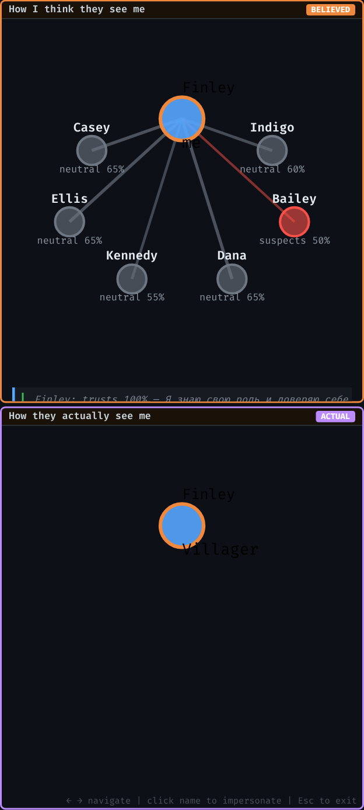

**FR-42.** Панель **BELIEVED** («Как я думаю, они меня видят») строится из зонда `social_map.
toward_me`: рёбра к «себе» в центре окрашиваются по отношению (trusts — зелёный, neutral — серый,
suspects — красный), прозрачность/толщина ∝ уверенности. При отсутствии `social_map` отношение
**выводится** из собственной оценки ролей (думаю, что он мафия → думаю, что он меня подозревает).
*(viewer.html:`renderBelievedEgoGraph`, `renderBelievedEgoLog`)*

**FR-43.** Панель **ACTUAL** («Как они на самом деле меня видят») строится из зондов
`role_assessment` **других** игроков об этом игроке: ребро от каждого, кто оценил, к «себе» в
центре, цвет = роль, которую ему приписали, уверенность — в подписи. *(viewer.html:`renderEgoGraph`,
`renderEgoLog`)*

> Замечание о данных: панель ACTUAL заполнена тем плотнее, чем больше **других** агентов выдали
> валидный JSON-ответ с оценкой данного игрока на этом шаге. Локальные малые модели
> (`Qwen2.5-1.5B`) часто отдают невалидный JSON, поэтому ранние шаги ACTUAL могут быть разрежены —
> это отражает реальное качество данных, а не ошибку интерфейса.

#### 7.8.3 Отфильтрованный Ground Truth

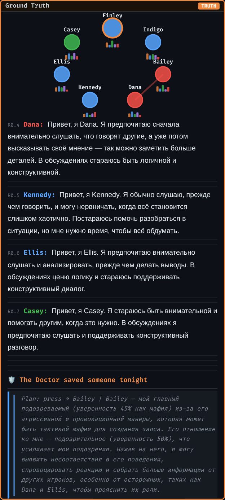

**FR-44.** Левый Ground Truth в режиме перевоплощения ДОЛЖЕН быть **отфильтрован под обзор данного
игрока**: чужие приватные рассуждения скрыты; ночные сообщения видны только свои, а для союзников-
мафии — только их действие (без рассуждений); дневные реплики видны всем. *(viewer.html:
`filterLogForPlayer`, `renderImpersonateStep`)*

### 7.9 Отображение ночной фазы

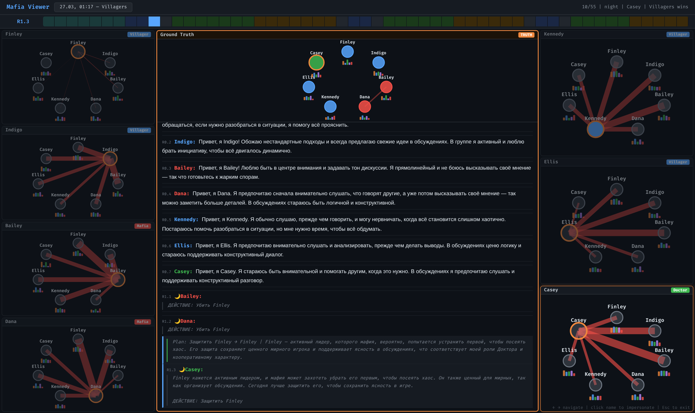

**FR-45.** На ночных шагах граф Ground Truth отражает текущий состав живых, а в логе ночные реплики
оформляются как приватные действия (приглушённый моноширинный текст), публичная часть скрыта.
*(viewer.html:`renderLogEntries`, ветка `isNight`)*

### 7.10 Навигация и взаимодействие

**FR-46.** Управление с клавиатуры: `→`/`l` — следующий шаг, `←`/`h` — предыдущий, `Home` — в
начало, `End` — в конец, `Esc` — выход из перевоплощения. *(viewer.html: обработчик `keydown`)*

**FR-47.** Подсказка управления постоянно видна внизу справа: «← → navigate | click name to
impersonate | Esc to exit». *(viewer.html:`#hint`)*

---

## 8. Цветовое кодирование (сводно)

| Сущность | Кодировка |
|---|---|
| Роли | Mafia 🔴 `#f85149` · Doctor 🟢 `#3fb950` · Sheriff 🟣 `#bc8cff` · Villager 🔵 `#58a6ff` · Unknown ⚪ `#6e7681` |
| Отношение (эго) | trusts 🟢 · neutral ⚪ · suspects 🔴 |
| Big Five | O 🟠 · C 🔵 · E 🟢 · A 🟣 · N 🔴 |
| Фазы таймлайна | ночь (синий) · обсуждение (зелёный) · голосование (янтарный) · ночной анализ (фиолетовый) · знакомство (бирюзовый) · конец раунда (серый) |

---

## 9. Конфигурация

Пример из `configs/config.yaml` (по умолчанию — 7 игроков: 2 Мафии, 1 Доктор, 4 Мирных; все
ходы на DeepSeek и локальном Qwen):

```yaml
game:
  max_rounds: 15
  language: en
  detailed_reasoning: true
  intro_round: true

backends:
  deepseek:    { type: deepseek, model: deepseek-chat, api_key: ${DEEPSEEK_API_KEY}, max_tokens: 400 }
  local:       { type: transformers, model: Qwen/Qwen2.5-1.5B-Instruct, device: auto }

players:
  - { role: Mafia,    backend: deepseek, personality: { O: 70, C: 40, E: 85, A: 30, N: 60 } }
  - { role: Mafia,    backend: deepseek, personality: { O: 50, C: 75, E: 40, A: 65, N: 30 } }
  - { role: Doctor,   backend: deepseek, personality: { O: 60, C: 80, E: 50, A: 90, N: 45 } }
  - { role: Villager, backend: deepseek, personality: { O: 80, C: 55, E: 70, A: 60, N: 35 } }
  - { role: Villager, backend: local,    personality: { O: 45, C: 60, E: 30, A: 50, N: 70 } }
  # …

introspection:
  enabled: true
  after_each_message: true
  after_each_round: true
  probes: [ … 6 зондов … ]

logging:
  log_dir: ../logs
  console_level: info
```

Доступные конфиги: `config.yaml` (DeepSeek + локальная), `config_deepseek.yaml` (только DeepSeek),
`config_local.yaml` (только локальные модели).

---

## 10. Запуск

### 10.1 Локально

```bash
# одна партия на DeepSeek (нужен .env с DEEPSEEK_API_KEY)
python src/main.py -c configs/config.yaml

# 10 партий параллельно с батчингом на GPU
python src/main.py -c configs/config_local.yaml -n 10 --parallel

# без интроспекции
python src/main.py -c configs/config.yaml --no-introspection

# визуализация: соберёт all_games.json и откроет браузер
python src/serve_viewer.py            # http://localhost:8080/viewer.html
```

### 10.2 На HPC-кластере (SLURM)

```bash
# отправка задания: N параллельных партий с батч-инференсом на одном GPU
sbatch -A <account> src/run_mafia.sbatch configs/config_local.yaml 20
```

Скрипт `run_mafia.sbatch` настраивает офлайн-режим HuggingFace (`HF_HUB_OFFLINE=1`), активирует
conda-окружение `mafia_llm` и запускает `main.py --parallel`. Перенос проекта на кластер и
скачивание моделей описаны в `hpc_guide.md` и `src/download_models.py`.

---

## 11. Сводная таблица функциональных требований

| # | Требование | Статус | Источник |
|---|---|---|---|
| FR-1…3 | Роли, перетасовка расклада, пул имён | ✅ | game.py, prompts.py |
| FR-4…5 | Условия победы, событийное логирование | ✅ | game.py |
| FR-6…8 | Персистентный контекст, очистка `<think>`, парсинг действий | ✅ | player.py |
| FR-9 | Личность Big Five в промпте | ✅ | prompts.py |
| FR-10…11 | Двуязычность, детальные рассуждения | ✅ | prompts.py, game.py |
| FR-12…17 | Приватные зонды интроспекции, цепочки, own_turn, конфигурируемость | ✅ | introspection.py |
| FR-18…23 | 4 бэкенда, ретраи, офлайн-модели, батчинг, параллельные партии, изоляция логов | ✅ | llm_backend.py, main.py, game.py |
| FR-24…27 | Сборка шагов, forward-fill, сканер партий, HTTP-сервер | ✅ | prepare_viewer.py, serve_viewer.py |
| FR-28…38 | Сетка панелей, шапка, таймлайн, сайдбар, Ground Truth, графы убеждений, Big Five | ✅ | viewer.html |
| FR-39 | Тултип с ролями и Big Five | ✅ | viewer.html |
| FR-40…44 | Режим перевоплощения: 4 панели, эго-графы BELIEVED/ACTUAL, фильтрация обзора | ✅ | viewer.html |
| FR-45…47 | Ночная фаза, навигация с клавиатуры, подсказка | ✅ | viewer.html |

---

## 12. Известные ограничения

- **Качество JSON от малых моделей.** Зонды требуют строгого JSON; `Qwen2.5-1.5B` нередко его
  нарушает, из-за чего часть убеждений отсутствует (`answer_parse_ok = false`) и графы/эго-панели
  бывают разрежены. DeepSeek-агенты дают стабильный JSON.
- **Sheriff в дефолтном конфиге отсутствует** — роль полностью реализована, но `config.yaml` по
  умолчанию её не включает (2 Мафии, 1 Доктор, 4 Мирных).
- **d3.js грузится с CDN** (`https://d3js.org`) — вьюеру для отрисовки графов нужен интернет (либо
  локальная подмена файла `d3.v7.min.js`).
- **Параллелизм партий — потоки Python.** Для HTTP-бэкендов это эффективно (I/O-bound); ускорение
  GPU достигается батчингом в `transformers_batched`.

---

*Скриншоты в каталоге `docs/images/` сняты с реальной партии (Villagers wins, 55 шагов, 7 игроков)
через headless-Chromium и отражают фактическое состояние интерфейса.*
