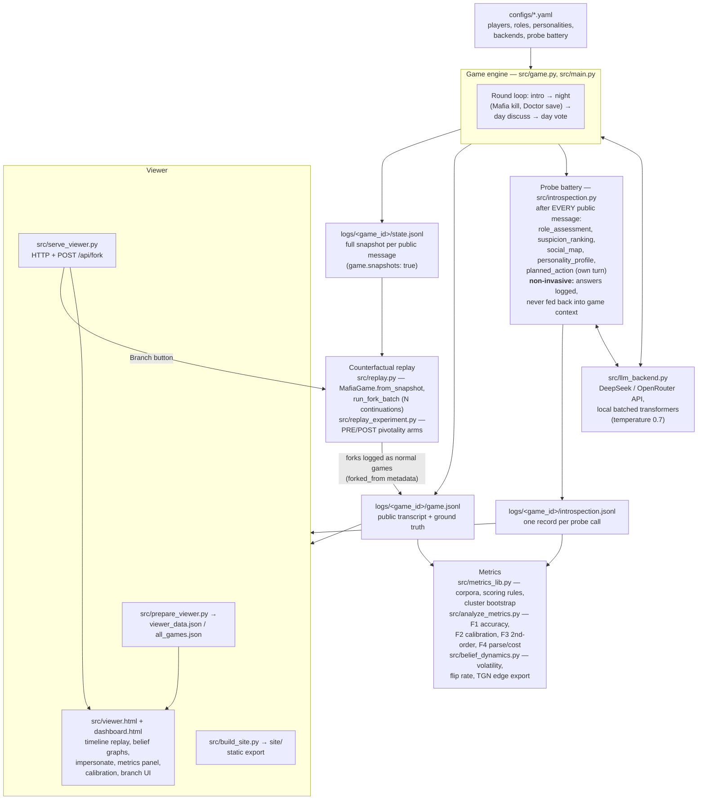

# MafiaScope architecture

Components and data flow, from a YAML config to the viewer, replay, and
metrics. All paths are relative to the repository root; scripts assume
`cwd=src/` (the engine resolves the log root as `../logs`).

## Data flow



Key properties:

- **Non-invasive probing.** `introspection.py` sends each probe as a
  detached continuation of the player's private context and **discards**
  the exchange afterwards; the game context an agent plays with is
  identical to a probe-free run. Probes are chained through the *log*
  instead: templates like `{last_role_assessment}` inject the agent's own
  previous answer into the next probe.
- **Ground truth for free.** Roles, night actions, votes, and deaths are
  in `game.jsonl`, so every belief record can be scored exactly.
- **Snapshots make the game forkable.** A snapshot is written after each
  public message has been broadcast and probed; `from_snapshot` restores
  every player's full conversation and continues with fresh sampling —
  "the snapshot restores the information state, not the randomness".
- **Forks are quarantined.** Fork games carry `forked_from` /
  `fork_point` / `fork_batch_id` / `replica_idx` in their `setup` record;
  `metrics_lib.select_corpus` excludes them from every corpus.

## Log directory layout

Each game writes one directory:

```
logs/<game_id>/
├── game.jsonl            # public transcript + ground truth events
├── introspection.jsonl   # one record per probe call
└── state.jsonl           # one full snapshot per public message (optional)
```

## `game.jsonl` — public transcript

One JSON object per line; every record has `game_id`, `kind`, `round`,
and (for events) a wall-clock `ts`. Record kinds: `setup`, `intro`,
`night_mafia`, `night_doctor`, `night_kill`, `night_analysis`,
`day_discuss`, `day_vote`, `vote_tally`, `day_eliminate`, `game_over`.

A real `setup` record (game `36594b66`, truncated player list):

```json
{"game_id": "36594b66-05d1-434c-be65-13360eafca9e", "kind": "setup", "round": 0,
 "players": [
   {"name": "Alex",  "role": "Villager", "model": "deepseek-chat", "backend": "deepseek",
    "personality": {"O": 45, "C": 60, "E": 30, "A": 50, "N": 70}},
   {"name": "Logan", "role": "Mafia",    "model": "deepseek-chat", "backend": "deepseek",
    "personality": {"O": 70, "C": 40, "E": 85, "A": 30, "N": 60}}
 ]}
```

Field notes: `players[*].role` is the ground-truth role; `personality` is
the assigned Big Five profile (0–100). Fork games additionally carry
`forked_from`, `fork_point`, `fork_batch_id`, `replica_idx` here.

A speech record and the vote/elimination events:

```json
{"game_id": "36594b66-…", "kind": "day_discuss", "round": 1, "player": "Alex",
 "response": "Okay, this is... rough. Jordan was pretty eager to jump into finding
 the bad guys, and now they're gone. …", "msg_seq": 9, "ts": 1783643720.4}

{"game_id": "36594b66-…", "kind": "vote_tally", "round": 1,
 "tally": {"Gray": 5, "Bailey": 1},
 "votes": {"Alex": "Gray", "Gray": "Bailey", "Logan": "Gray", "Finley": "Gray",
           "Casey": "Gray", "Bailey": "Gray"}, "ts": 1783644473.6}

{"game_id": "36594b66-…", "kind": "day_eliminate", "round": 1,
 "eliminated": "Gray", "role": "Villager", "votes": 5, "ts": 1783644473.6}

{"game_id": "36594b66-…", "kind": "game_over", "round": 2, "winner": "Mafia",
 "ts": 1783644941.3}
```

`msg_seq` is the public-message counter within the game; it is the join
key to `introspection.jsonl` (`public_msg_seq`) and `state.jsonl`
(`msg_seq`). `night_kill` carries `victim`; `day_eliminate` carries
`eliminated` plus the revealed true `role`.

## `introspection.jsonl` — probe records

One record per probe call. Composite key:
`(round, public_msg_seq, player_idx, probe_seq)`.

A real `suspicion_ranking` record (same game, abbreviated `answer_raw`):

```json
{"timestamp": 1783642455.23, "game_id": "36594b66-05d1-434c-be65-13360eafca9e",
 "round": 0, "public_msg_seq": 1, "player_idx": 0, "player_name": "Alex",
 "probe_seq": 1, "probe_id": "suspicion_ranking",
 "question": "Rank alive players (Alex, Gray, Logan, Jordan, Finley, Casey, Bailey)
   from most to least suspicious. Answer ONLY as JSON: [{\"player\": \"...\", \"score\": N}, ...]",
 "answer_raw": "[\n  {\"player\": \"Gray\", \"score\": 7},\n  {\"player\": \"Logan\", \"score\": 6}, …]",
 "answer_parsed": [{"player": "Gray", "score": 7}, {"player": "Logan", "score": 6}],
 "answer_parse_ok": true,
 "model": "deepseek-chat", "role": "Villager", "phase": "intro",
 "latency_ms": 1405, "chain_used_raw_fallback": false}
```

| field | meaning |
|---|---|
| `round`, `public_msg_seq` | game step the probe reacts to (join to `game.jsonl`) |
| `player_idx`, `player_name`, `role` | probed agent and its ground-truth role |
| `probe_seq`, `probe_id` | position in the battery and probe type |
| `question` | fully rendered prompt (placeholders like `{players}`, `{last_role_assessment}` resolved) |
| `answer_raw` | verbatim model output |
| `answer_parsed`, `answer_parse_ok` | strict-JSON parse result; `null`/`false` if unparsable (metrics re-parse `answer_raw` with the JSON-repair pass — "repaired" mode) |
| `phase` | game phase at probe time (`intro`, `night`, `day_discussion`, `day_vote`, …) |
| `latency_ms`, `model` | probe cost accounting |
| `chain_used_raw_fallback` | probe chaining fell back to the previous *raw* answer because the parsed one was missing |

Probe types and payloads (`answer_parsed`):

- `role_assessment` — `[{player, guessed_role: Mafia|Villager|Doctor|Unknown, confidence: 0-100, reason}]`
- `suspicion_ranking` — `[{player, score}]`, higher = more suspicious
- `social_map` — `{"toward_me": [{player, attitude: trusts|neutral|suspects, confidence, reason}]}` (second-order beliefs)
- `personality_profile` — `[{player, O, C, E, A, N, summary}]`
- `planned_action` — `{action, target, reasoning}` (fires only on the agent's own turn)

## `state.jsonl` — snapshots for counterfactual replay

One full-game snapshot per public message, keyed by `(round, msg_seq)`;
written **after** message `msg_seq` was broadcast to all players and
probed. A real record (contexts truncated):

```json
{"game_id": "36594b66-05d1-434c-be65-13360eafca9e", "round": 0, "msg_seq": 1,
 "phase": "intro",
 "pending": {"stage": "intro", "remaining": ["Gray", "Logan", "Jordan", "Finley", "Casey", "Bailey"]},
 "night_result": null, "sheriff_checks": {},
 "alive": ["Alex", "Gray", "Logan", "Jordan", "Finley", "Casey", "Bailey"],
 "players": [
   {"name": "Alex", "idx": 0, "role": "Villager", "backend_name": "deepseek",
    "model_label": "deepseek-chat",
    "personality": {"O": 45, "C": 60, "E": 30, "A": 50, "N": 70},
    "language": "en", "alive": true,
    "messages": [
      {"role": "system", "content": "You are Alex, a player in a Mafia party game. …"},
      {"role": "user",   "content": "This is the INTRODUCTION ROUND. …"}
    ]}
 ],
 "ts": 1783642460.1}
```

| field | meaning |
|---|---|
| `round`, `msg_seq` | fork point key (`replay.py --list` enumerates them) |
| `phase`, `pending` | resume point: which stage the game is in and who still has to act |
| `night_result`, `sheriff_checks` | carried night information |
| `alive` | living players at snapshot time |
| `players[*].messages` | the agent's **complete** private conversation (system prompt, everything it saw and said) — this is what makes a fork bit-exact |

`MafiaGame.from_snapshot(cfg, parent_dir, round, msg_seq)` restores this
state and continues the game from the next step with fresh LLM sampling;
`run_fork_batch` runs N such continuations (optionally in parallel), each
logged as a normal game directory.

## Viewer and metrics consumers

- `prepare_viewer.py` merges `game.jsonl` + `introspection.jsonl` into
  step-indexed viewer data (per-step belief graphs with forward-fill),
  `serve_viewer.py` serves it and exposes the fork API
  (`POST /api/fork {game_id, round, seq, n_replays}`) used by the
  viewer's Branch dialog; branches appear in the sidebar as they finish.
- `metrics_lib.py` loads every `logs/*/` directory, applies corpus
  selection (see [dataset.md](dataset.md)), and defines the canonical
  scoring rules; `analyze_metrics.py` reports the paper metrics with
  game-level cluster bootstrap CIs; `belief_dynamics.py` adds temporal
  belief metrics and the TGN edge-stream export.
